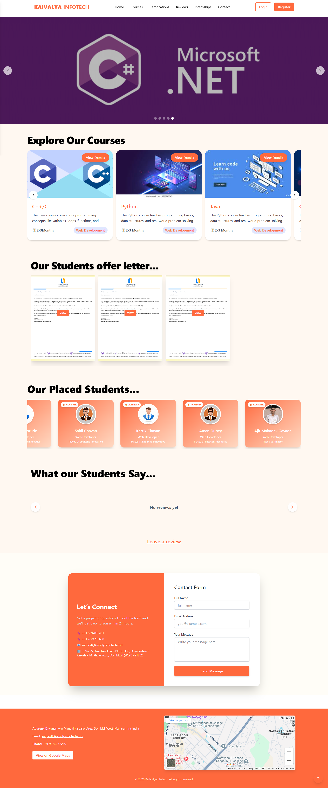

# 🌐 KaivalyaInfotech - Fullstack Educational Coaching Website

KaivalyaInfotech is a modern educational coaching institute website built using the **MERN stack** (MongoDB, Express.js, React.js, Node.js). It includes features like student placement records, course details, certificate uploads, testimonials, and admin dashboard.

🚀 **Live Website**: [https://kaivalyainfotech.vercel.app](https://kaivalyainfotech.vercel.app)
🔧 **Backend API**: [https://kaivalyainfotechbackend.onrender.com](https://kaivalyainfotechbackend.onrender.com)

---

## 🛠 Tech Stack

- **Frontend**: React.js, Tailwind CSS, Axios, React Router DOM
- **Backend**: Node.js, Express.js, Mongoose
- **Database**: MongoDB
- **Auth**: JWT with HTTP-Only Cookies
- **Deployment**:
  - Frontend: Vercel
  - Backend: Render

---

## 📦 Features

- ✅ JWT-Based Secure Authentication (Admin/User)
- ✅ Add & manage Courses, Certificates, Placements
- ✅ Upload Banner images and display dynamically
- ✅ Responsive design with mobile-first approach
- ✅ Admin Dashboard with role-based access
- ✅ Contact Form & Testimonials section

---

